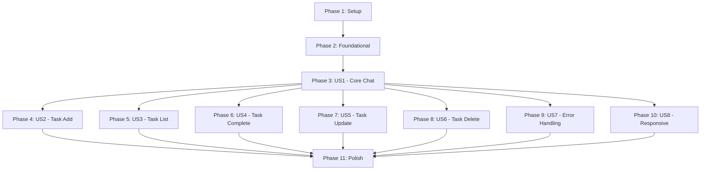

# Tasks: Frontend Chat UI (ChatKit)

**Input**: Design documents from `/specs/004-chatkit-ui/`
**Prerequisites**: plan.md, spec.md, research.md, data-model.md, contracts/chat-api.yaml

**Tests**: Tests are NOT requested in specification - focusing on implementation only

**Organization**: Tasks grouped by user story to enable independent implementation and testing

## Format: `- [ ] [ID] [P?] [Story?] Description`

- **[P]**: Can run in parallel (different files, no dependencies)
- **[Story]**: Which user story this task belongs to (US1, US2, etc.)
- **File paths**: All paths relative to `frontend/` directory

## Implementation Strategy

**MVP Scope**: User Story 1 (Send Message and Receive Response)
- Establishes core chat functionality
- Validates frontend-backend communication
- Demonstrates stateless operation

**Incremental Delivery**:
1. Phase 3 (US1): Core chat communication - **DEMO READY**
2. Phase 4-5 (US2-US3): Task operations confirmation display
3. Phase 6-8 (US4-US7): Enhanced error handling and remaining operations
4. Phase 9 (US8): Responsive design polish
5. Phase 10: Cross-cutting performance and accessibility

---

## Phase 1: Setup (Shared Infrastructure)

**Purpose**: Project initialization and dependency installation

- [x] T001 Install react-chatbotify library in frontend/package.json
- [x] T002 [P] Create TypeScript type definitions in frontend/src/types/chat.ts
- [x] T003 [P] Configure environment variables in frontend/.env.local (API_BASE_URL, DEV_USER_ID)
- [x] T004 [P] Create base CSS modules structure in frontend/src/components/chat/*.module.css

**Checkpoint**: Dependencies installed, types defined, environment configured

---

## Phase 2: Foundational (Blocking Prerequisites)

**Purpose**: Core infrastructure required by all user stories

**⚠️ CRITICAL**: No user story work can begin until this phase is complete

- [x] T005 Create API client service in frontend/src/services/chatApi.ts with Fetch implementation
- [x] T006 [P] Implement error formatter utility in frontend/src/utils/errorFormatter.ts
- [x] T007 [P] Implement message formatter utility in frontend/src/utils/messageFormatter.ts
- [x] T008 [P] Create validation utilities in frontend/src/utils/validation.ts
- [x] T009 Create useChatApi custom hook in frontend/src/hooks/useChatApi.ts

**Checkpoint**: Foundation ready - API client, utilities, and base hooks available

---

## Phase 3: User Story 1 - Send Message and Receive AI Response (Priority: P1) 🎯 MVP

**Goal**: Enable users to type messages, send them to the backend, and receive AI responses displayed in the chat

**Independent Test**: Send "Hello" message and verify API call completes successfully with response displayed in chat window

### Implementation for User Story 1

- [x] T010 [P] [US1] Create Message interface and types in frontend/src/types/chat.ts (id, text, sender, timestamp, status, metadata)
- [x] T011 [P] [US1] Create ChatRequest and ChatResponse interfaces in frontend/src/types/chat.ts
- [x] T012 [P] [US1] Create MessageBubble component in frontend/src/components/chat/MessageBubble.tsx (render single message with styling for user vs assistant)
- [x] T013 [P] [US1] Create MessageList component in frontend/src/components/chat/MessageList.tsx (scrollable container, renders MessageBubble array)
- [x] T014 [P] [US1] Create ChatInput component in frontend/src/components/chat/ChatInput.tsx (input field, send button, empty message validation)
- [x] T015 [P] [US1] Create LoadingIndicator component in frontend/src/components/chat/LoadingIndicator.tsx (typing animation with 3 dots)
- [x] T016 [US1] Create useChat custom hook in frontend/src/hooks/useChat.ts (message state management, send message logic, loading state)
- [x] T017 [US1] Create ChatInterface container component in frontend/src/components/chat/ChatInterface.tsx (integrates all components, connects to useChat hook)
- [x] T018 [US1] Implement auto-scroll to bottom logic in MessageList component when new messages arrive
- [x] T019 [US1] Add message status indicators (sending, sent, error) in MessageBubble component
- [x] T020 [US1] Handle chronological message ordering in useChat hook (display messages in send order)

**Checkpoint**: User can send messages, see them appear in chat, receive AI responses - Core MVP functional

---

## Phase 4: User Story 2 - Add New Tasks via Natural Language (Priority: P1)

**Goal**: Display task creation confirmations with task details extracted from AI responses

**Independent Test**: Send "Add task to buy groceries" and verify confirmation displays task name and ID

### Implementation for User Story 2

- [x] T021 [P] [US2] Add TaskSummary interface to frontend/src/types/chat.ts (id, name, status, dueDate)
- [x] T022 [P] [US2] Add ResponseMetadata interface to frontend/src/types/chat.ts (operation, taskId, taskName, taskStatus)
- [x] T023 [US2] Update messageFormatter utility in frontend/src/utils/messageFormatter.ts to extract task creation confirmations
- [x] T024 [US2] Update MessageBubble component to render task confirmation metadata (highlighted task ID, name)
- [x] T025 [US2] Add visual distinction for task confirmation messages (icon, background color, or badge)

**Checkpoint**: Task creation confirmations display prominently with task details

---

## Phase 5: User Story 3 - List and View All Tasks (Priority: P1)

**Goal**: Format and display task lists returned from AI responses in readable structure

**Independent Test**: Send "Show me all my tasks" and verify task list displays with task details (name, status, due date)

### Implementation for User Story 3

- [x] T026 [P] [US3] Extend ResponseMetadata interface to include taskCount and tasks array
- [x] T027 [US3] Update messageFormatter utility to handle task list formatting
- [x] T028 [US3] Create TaskListDisplay sub-component in frontend/src/components/chat/TaskListDisplay.tsx (formatted task list within message bubble)
- [x] T029 [US3] Update MessageBubble component to conditionally render TaskListDisplay when metadata contains task list
- [x] T030 [US3] Add visual formatting for task list (numbered list, status badges, due date display)
- [x] T031 [US3] Handle empty task list case with appropriate message display

**Checkpoint**: Task lists display in readable format with visual separation between tasks

---

## Phase 6: User Story 4 - Mark Tasks as Complete (Priority: P2)

**Goal**: Display task completion confirmations from AI responses

**Independent Test**: Send "Mark task 3 as complete" and verify confirmation displays updated task status

### Implementation for User Story 4

- [x] T032 [P] [US4] Add taskStatus field to ResponseMetadata interface (active, completed)
- [x] T033 [US4] Update messageFormatter to handle completion confirmations
- [x] T034 [US4] Update MessageBubble to display completion status changes (strikethrough for completed tasks, status badge)
- [x] T035 [US4] Add visual feedback for task status transitions in message display

**Checkpoint**: Task completion confirmations show clearly with visual status indicators

---

## Phase 7: User Story 5 - Update and Modify Existing Tasks (Priority: P2)

**Goal**: Display task update confirmations showing before/after changes

**Independent Test**: Send "Update task 2 due date to Friday" and verify confirmation shows updated details

### Implementation for User Story 5

- [x] T036 [US5] Update messageFormatter to handle task update confirmations
- [x] T037 [US5] Update MessageBubble to display updated task fields (highlight changed fields)
- [x] T038 [US5] Add comparison display for showing old vs new values when task is updated

**Checkpoint**: Task updates display clearly showing what changed

---

## Phase 8: User Story 6 - Delete Tasks (Priority: P3)

**Goal**: Display task deletion confirmations

**Independent Test**: Send "Delete task 5" and verify confirmation message appears

### Implementation for User Story 6

- [x] T039 [US6] Update messageFormatter to handle deletion confirmations
- [x] T040 [US6] Update MessageBubble to display deletion confirmation with task details

**Checkpoint**: Task deletions are confirmed with clear messaging

---

## Phase 9: User Story 7 - Handle Errors Gracefully (Priority: P2)

**Goal**: Display user-friendly error messages for API failures and network issues

**Independent Test**: Disconnect network and send message, verify user-friendly error appears

### Implementation for User Story 7

- [x] T041 [P] [US7] Create ErrorNotification component in frontend/src/components/chat/ErrorNotification.tsx (toast notification style)
- [x] T042 [P] [US7] Add ApiError interface to frontend/src/types/chat.ts (error, code, details)
- [x] T043 [US7] Update errorFormatter utility with comprehensive error message mapping (NetworkError, TimeoutError, ServerError, ValidationError)
- [ ] T044 [US7] Integrate ErrorNotification into ChatInterface component
- [ ] T045 [US7] Add error handling to useChatApi hook for network failures
- [ ] T046 [US7] Add error handling to useChatApi hook for timeout scenarios (30 second timeout)
- [ ] T047 [US7] Add error handling to useChatApi hook for malformed JSON responses
- [ ] T048 [US7] Update MessageBubble to display inline error messages for failed message sends
- [ ] T049 [US7] Add retry mechanism in ChatInterface for failed messages
- [ ] T050 [US7] Handle empty message submission prevention in ChatInput component

**Checkpoint**: All error scenarios display user-friendly messages with retry options

---

## Phase 10: User Story 8 - Responsive Mobile and Desktop Experience (Priority: P3)

**Goal**: Ensure chat interface adapts to different screen sizes (320px - 1920px)

**Independent Test**: Open chat on desktop (1920px), tablet (768px), and mobile (320px) and verify layout adapts correctly

### Implementation for User Story 8

- [ ] T051 [P] [US8] Create responsive CSS for ChatInterface in frontend/src/components/chat/ChatInterface.module.css (mobile-first, Flexbox layout)
- [ ] T052 [P] [US8] Add mobile breakpoint styles (@media max-width: 767px) for ChatInterface
- [ ] T053 [P] [US8] Add tablet breakpoint styles (@media 768px-1023px) for ChatInterface
- [ ] T054 [P] [US8] Add desktop breakpoint styles (@media min-width: 1024px) for ChatInterface
- [ ] T055 [P] [US8] Create responsive CSS for MessageList (full height on mobile, comfortable margins on desktop)
- [ ] T056 [P] [US8] Create responsive CSS for ChatInput (full width on mobile, centered on desktop)
- [ ] T057 [P] [US8] Create responsive CSS for MessageBubble (touch-friendly sizing on mobile, comfortable on desktop)
- [ ] T058 [US8] Test layout on actual mobile device (320px width minimum)
- [ ] T059 [US8] Test layout on tablet (768px width)
- [ ] T060 [US8] Test layout on desktop (1920px width maximum)
- [ ] T061 [US8] Verify input area remains accessible on mobile keyboards (fixed positioning, keyboard-aware)
- [ ] T062 [US8] Verify orientation changes preserve message history (no data loss on rotate)

**Checkpoint**: Chat interface fully responsive across all specified screen sizes

---

## Phase 11: Polish & Cross-Cutting Concerns

**Purpose**: Performance optimization, accessibility, and final touches

- [ ] T063 [P] Implement message virtualization using react-window in MessageList component for 100+ messages
- [ ] T064 [P] Add scroll position preservation when user manually scrolls up in MessageList
- [ ] T065 [P] Optimize re-renders using React.memo for MessageBubble component
- [ ] T066 [P] Add keyboard navigation support (Enter to send, Tab between inputs)
- [ ] T067 [P] Add ARIA labels to ChatInput component (input field, send button)
- [ ] T068 [P] Add ARIA labels to MessageList component (chat history, message count)
- [ ] T069 [P] Add focus states to ChatInput for keyboard navigation visibility
- [ ] T070 Add cleanup logic to useChat hook to cancel pending requests on unmount
- [ ] T071 Add performance monitoring for message render time (< 100ms target)
- [ ] T072 Verify smooth scrolling with 100+ messages (no frame drops)
- [ ] T073 Add console logging in development mode for debugging API calls
- [ ] T074 Final integration test of complete chat flow (send, receive, error, retry)

**Checkpoint**: Production-ready chat interface with optimized performance and accessibility

---

## Dependencies and Parallel Execution

### User Story Dependencies (Completion Order)

**Critical Path**: Setup → Foundational → US1 (MVP) → US2/US3 (P1 stories) → US7 (Error handling)

**Parallel Opportunities**:
- After US1 complete: US2, US3, US4, US5, US6, US7, US8 can be worked on in parallel (different features)
- Within each phase: Tasks marked [P] can run concurrently (different files)

### Parallel Execution Examples

**Phase 1 (Setup)**: Tasks T001-T004 can all run in parallel (different files/configs)

**Phase 2 (Foundational)**: Tasks T006, T007, T008 can run in parallel (different utilities)

**Phase 3 (US1)**:
- T010, T011 (types) in parallel
- Then T012, T013, T014, T015 (components) in parallel
- Then T016, T017, T018 (integration) sequentially

**After US1**: All of US2-US8 can start in parallel since they extend US1 without blocking each other

### Recommended Implementation Sequence

1. **Week 1 (MVP)**:
   - Day 1: Phase 1 + Phase 2 (Setup + Foundation)
   - Day 2-3: Phase 3 (US1 - Core chat functionality)
   - Day 4: Demo preparation and testing

2. **Week 2 (Enhancement)**:
   - Day 1: Phase 4 + Phase 5 (US2, US3 - Task confirmations)
   - Day 2: Phase 9 (US7 - Error handling)
   - Day 3: Phase 10 (US8 - Responsive design)
   - Day 4: Phase 11 (Polish and optimization)

3. **Continuous**:
   - Phases 6, 7, 8 (US4, US5, US6) can be added incrementally after MVP demo

---

## MVP Definition

**Minimum Viable Product (MVP)** = Phases 1 + 2 + 3

This delivers:
- ✅ Chat interface loads and displays
- ✅ User can type and send messages
- ✅ Messages appear in chronological order
- ✅ Loading indicator shows during API requests
- ✅ AI responses display correctly
- ✅ Basic error handling (empty message prevention)
- ✅ Auto-scroll to newest messages

**MVP Test Scenario**:
1. Open chat interface
2. Type "Hello"
3. Click Send
4. Verify user message appears
5. Verify loading indicator shows
6. Verify AI response appears below user message
7. Repeat with "Add task to buy groceries"
8. Verify second exchange displays correctly

**Demo-Ready Scope** = MVP + Phase 4 + Phase 5 + Phase 9

Adds task confirmation display and error handling for professional demo.

---

## Task Summary

**Total Tasks**: 74

**By Phase**:
- Phase 1 (Setup): 4 tasks
- Phase 2 (Foundational): 5 tasks
- Phase 3 (US1 - MVP): 11 tasks
- Phase 4 (US2): 5 tasks
- Phase 5 (US3): 6 tasks
- Phase 6 (US4): 4 tasks
- Phase 7 (US5): 3 tasks
- Phase 8 (US6): 2 tasks
- Phase 9 (US7): 10 tasks
- Phase 10 (US8): 12 tasks
- Phase 11 (Polish): 12 tasks

**By User Story**:
- US1 (Send/Receive Messages): 11 tasks - **MVP Core**
- US2 (Add Tasks): 5 tasks
- US3 (List Tasks): 6 tasks
- US4 (Complete Tasks): 4 tasks
- US5 (Update Tasks): 3 tasks
- US6 (Delete Tasks): 2 tasks
- US7 (Error Handling): 10 tasks
- US8 (Responsive Design): 12 tasks
- Infrastructure (Setup + Foundational): 9 tasks
- Polish (Cross-cutting): 12 tasks

**Parallel Opportunities**: 40 tasks marked [P] can run concurrently (54% parallelizable)

**Independent User Stories**: After US1, stories US2-US8 are independent (can be implemented in any order)

---

## Validation Checklist

✅ All tasks follow format: `- [ ] [ID] [P?] [Story?] Description with file path`
✅ Task IDs are sequential (T001-T074)
✅ User story labels applied to relevant tasks ([US1]-[US8])
✅ Parallel tasks marked with [P]
✅ File paths specified for all implementation tasks
✅ Each user story has independent test criteria
✅ Dependencies documented with execution order
✅ MVP scope clearly defined (Phases 1-3)
✅ Parallel execution examples provided
✅ Task organization enables incremental delivery
